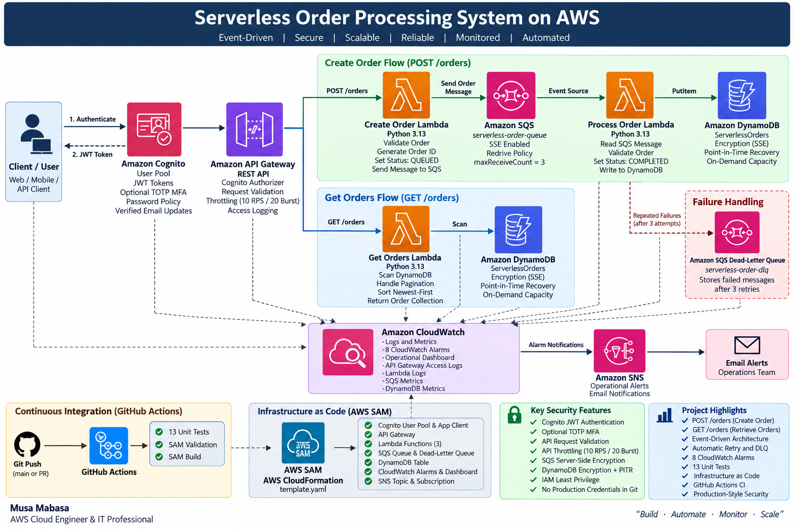

# Serverless Order Processing System on AWS

A production-style **serverless order processing system** built on AWS using event-driven architecture, Infrastructure as Code (IaC), authentication, asynchronous processing, monitoring, security controls, automated testing, continuous integration, and automatic failure handling.

This project demonstrates practical AWS Cloud Engineering skills including REST API development, serverless compute, asynchronous messaging, NoSQL storage, authentication and authorization, observability, security hardening, failure recovery, Infrastructure as Code, automated testing, and CI.

---

## Architecture



The application uses an event-driven serverless architecture to securely create, queue, process, retrieve, store, and monitor customer orders.

### Create Order Flow

```text
Client
  |
  v
Amazon Cognito
  |
  v
JWT Token
  |
  v
Amazon API Gateway
  |
  | POST /orders
  v
Create Order Lambda
  |
  v
Amazon SQS
  |
  v
Process Order Lambda
  |
  v
Amazon DynamoDB
```

### Retrieve Orders Flow

```text
Client
  |
  v
Amazon Cognito
  |
  v
JWT Token
  |
  v
Amazon API Gateway
  |
  | GET /orders
  v
Get Orders Lambda
  |
  v
Amazon DynamoDB
```

### Failure Handling

```text
Processing Failure -> SQS Retry -> Dead-Letter Queue
```

### Monitoring

```text
AWS Services -> Amazon CloudWatch -> Amazon SNS -> Email Alerts
```

### CI Pipeline

```text
Git Push -> GitHub Actions -> Unit Tests -> SAM Validation -> SAM Build
```

[View detailed architecture and request flow](docs/architecture.md)

---

## AWS Services

| Service            | Purpose                                           |
| ------------------ | ------------------------------------------------- |
| Amazon Cognito     | User authentication, JWT tokens, and optional MFA |
| Amazon API Gateway | Authenticated REST API                            |
| AWS Lambda         | Create, process, and retrieve orders              |
| Amazon SQS         | Asynchronous order queue                          |
| Amazon SQS DLQ     | Isolation of repeatedly failed messages           |
| Amazon DynamoDB    | Persistent order storage                          |
| Amazon CloudWatch  | Logs, metrics, alarms, and dashboard              |
| Amazon SNS         | Operational alarm notifications                   |
| AWS IAM            | Least-privilege service permissions               |
| AWS SAM            | Serverless Infrastructure as Code                 |
| AWS CloudFormation | AWS resource provisioning                         |
| GitHub Actions     | Continuous integration                            |
| GitHub             | Source control and project hosting                |

---

## API Endpoints

The application currently exposes two authenticated operations.

| Method | Endpoint  | Purpose                                        |
| ------ | --------- | ---------------------------------------------- |
| `POST` | `/orders` | Submit a new order for asynchronous processing |
| `GET`  | `/orders` | Retrieve processed orders                      |

Both endpoints require a valid Amazon Cognito JWT.

Requests without valid authentication are rejected with:

```text
Unauthorized
```

---

## How It Works

### 1. User Authentication

Users authenticate through **Amazon Cognito**.

After successful authentication, Cognito returns JWT tokens.

The ID token is supplied to API Gateway:

```text
Authorization: Bearer <JWT_TOKEN>
```

API Gateway uses a Cognito User Pool Authorizer to validate the token before allowing access to protected API operations.

Unauthenticated, invalid, or expired requests are rejected.

---

## POST /orders

### 2. Create Order Request

Authenticated clients submit orders using:

```http
POST /orders
```

Example request:

```json
{
  "customer_name": "Mabasa Technologies",
  "customer_email": "customer@example.com",
  "items": [
    {
      "product": "Cloud Server",
      "quantity": 1,
      "price": 250
    }
  ]
}
```

API Gateway performs request-body validation before forwarding valid requests to the Create Order Lambda.

---

### 3. Create Order Lambda

The **Create Order Lambda**:

* Parses the request body
* Validates customer information
* Validates order items
* Calculates the total
* Generates a unique order ID
* Adds a creation timestamp
* Sets the initial status to `QUEUED`
* Publishes the order to Amazon SQS

Example response:

```json
{
  "message": "Order accepted for processing",
  "order_id": "ORD-A49434F9",
  "status": "QUEUED"
}
```

The API returns:

```text
202 Accepted
```

The client therefore does not need to wait for downstream order processing to finish.

---

### 4. Amazon SQS

Amazon SQS decouples order submission from processing.

```text
Create Order Lambda
        |
        v
   Amazon SQS
        |
        v
Process Order Lambda
```

This design improves:

* Reliability
* Scalability
* Fault tolerance
* Service decoupling
* Failure recovery
* Traffic buffering

SQS server-side encryption is enabled.

---

### 5. Process Order Lambda

The **Process Order Lambda** is automatically triggered by messages arriving in the SQS queue.

The function:

1. Reads the SQS event
2. Parses each order message
3. Validates the `order_id`
4. Sets the status to `COMPLETED`
5. Adds a `processed_at` timestamp
6. Writes the completed order to DynamoDB

This separates the API request lifecycle from backend order processing.

---

### 6. Amazon DynamoDB

Processed orders are stored in:

```text
ServerlessOrders
```

Primary key:

```text
order_id
```

Example stored order:

```json
{
  "order_id": "ORD-A49434F9",
  "customer_name": "Mabasa Technologies",
  "customer_email": "customer@example.com",
  "status": "COMPLETED",
  "total": 250,
  "created_at": "2026-09-03T12:13:48+00:00",
  "processed_at": "2026-09-03T12:13:49+00:00"
}
```

DynamoDB is configured with:

* Server-side encryption
* Point-in-Time Recovery
* PAY_PER_REQUEST billing

---

## GET /orders

### 7. Retrieve Orders Request

Authenticated clients can retrieve processed orders using:

```http
GET /orders
```

API Gateway validates the Cognito JWT before invoking the Get Orders Lambda.

A request without authentication correctly returns:

```json
{
  "message": "Unauthorized"
}
```

---

### 8. Get Orders Lambda

The **Get Orders Lambda** retrieves orders from the `ServerlessOrders` DynamoDB table.

The function:

* Scans the DynamoDB table
* Handles DynamoDB pagination using `LastEvaluatedKey`
* Combines results across multiple scan operations
* Sorts orders by `created_at`
* Returns newest orders first
* Converts DynamoDB `Decimal` values to JSON-compatible numbers
* Returns a count and order collection
* Handles DynamoDB errors with HTTP 500 responses

Example response:

```json
{
  "count": 6,
  "orders": [
    {
      "order_id": "ORD-7ED11B6E",
      "customer_name": "Mabasa Technologies",
      "customer_email": "customer@example.com",
      "status": "COMPLETED",
      "total": 100,
      "created_at": "2026-09-04T09:31:29+00:00",
      "processed_at": "2026-09-04T09:31:30+00:00"
    }
  ]
}
```

The endpoint was successfully tested against the deployed AWS environment.

---

## Failure Handling

The application implements automatic SQS retry and Dead-Letter Queue handling.

```text
Main SQS Queue
      |
      v
Process Lambda
      |
   Failure
      |
      v
SQS Retry
      |
Repeated Failure
      |
      v
Dead-Letter Queue
```

The main queue uses a redrive policy with:

```text
maxReceiveCount = 3
```

Messages that continue failing are moved to:

```text
serverless-order-dlq
```

This prevents problematic messages from blocking normal processing.

---

## DLQ Validation

Failure handling was tested using a deliberately invalid SQS message.

The Process Order Lambda failed while parsing the malformed message.

Amazon SQS automatically retried the message before moving it to the Dead-Letter Queue.

The DLQ test demonstrated:

* Lambda failure handling
* SQS retry behavior
* Redrive policy operation
* DLQ routing
* Failed-message isolation

The test message was removed after validation and the DLQ was returned to an empty state.

---

## Security

The project implements multiple AWS security controls.

### Amazon Cognito

The API is protected by an Amazon Cognito User Pool.

```text
User
 |
 v
Amazon Cognito
 |
 v
JWT Token
 |
 v
API Gateway
 |
 +---- POST /orders
 |
 `---- GET /orders
```

Both API operations require authenticated access.

---

### Optional TOTP MFA

Software-token MFA is enabled using:

```text
TOTP
```

Configuration:

```text
OPTIONAL
```

Users can therefore configure an authenticator application without MFA being mandatory for every account.

---

### Cognito Token Security

Configured token lifetimes:

| Token         | Lifetime |
| ------------- | -------: |
| Access Token  |   1 hour |
| ID Token      |   1 hour |
| Refresh Token |   7 days |

User-existence error protection is enabled.

Email changes require verification before the updated address becomes active.

---

### Password Policy

The Cognito password policy requires:

* Minimum 8 characters
* Uppercase characters
* Lowercase characters
* Numbers
* Symbols

---

### API Gateway Throttling

API Gateway throttling protects the application against excessive request rates.

Configured limits:

```text
Rate Limit: 10 requests/second
Burst Limit: 20 requests
```

CloudWatch API metrics are enabled.

---

### Request Validation

API Gateway validates incoming `POST /orders` request bodies.

Required properties include:

* `customer_name`
* `customer_email`
* `items`

Additional business validation is performed by Lambda.

This provides two validation layers:

```text
API Gateway Validation
        |
        v
Lambda Business Validation
```

Lambda validates:

* Customer name
* Customer email
* Items list
* Product name
* Quantity
* Price

---

### SQS Encryption

Server-side encryption is enabled for:

```text
serverless-order-queue
serverless-order-dlq
```

---

### DynamoDB Protection

The DynamoDB table uses:

* Server-side encryption
* Point-in-Time Recovery
* On-demand capacity

---

### IAM Least Privilege

The Lambda functions use restricted IAM permissions.

**Create Order Lambda**

```text
sqs:SendMessage
```

**Process Order Lambda**

```text
dynamodb:PutItem
```

**Get Orders Lambda**

```text
dynamodb:Scan
```

Each function receives only the application permissions required for its responsibility.

---

## API Access Logging

API Gateway access logging is enabled.

Log group:

```text
/aws/apigateway/serverless-order-api
```

Logs capture information including:

* Request ID
* Source IP
* Request time
* HTTP method
* Resource path
* HTTP status
* Response size
* Response latency
* Integration latency
* Integration errors

Both `POST` and `GET` API activity can therefore be monitored through CloudWatch.

---

## CloudWatch Logs

Application and API logs are available under:

```text
/aws/lambda/serverless-create-order
/aws/lambda/serverless-process-order
/aws/lambda/serverless-get-orders
/aws/apigateway/serverless-order-api
```

Logs support:

* Troubleshooting
* Request tracing
* Error investigation
* Performance analysis
* Operational monitoring

---

## Monitoring and Alerting

Amazon CloudWatch provides centralized monitoring for the application.

The deployed project contains **8 CloudWatch alarms**.

### CloudWatch Alarms

1. Create Order Lambda errors
2. Process Order Lambda errors
3. Get Orders Lambda errors
4. DLQ messages detected
5. Main SQS queue backlog
6. API Gateway 5XX errors
7. API Gateway 4XX errors
8. API Gateway high latency

The Get Orders Lambda alarm is:

```text
serverless-get-orders-errors
```

The alarm was successfully deployed and verified in:

```text
OK
```

state.

These alarms provide monitoring across the API, compute, messaging, retrieval, and failure-handling layers.

---

## SNS Notifications

CloudWatch alarms publish operational notifications through Amazon SNS.

```text
CloudWatch Alarm
       |
       v
   Amazon SNS
       |
       v
Operational Alert
```

This allows infrastructure and application problems to generate notifications instead of relying solely on manual monitoring.

---

## CloudWatch Dashboard

A CloudWatch dashboard is deployed through Infrastructure as Code.

Dashboard:

```text
serverless-order-processing-dashboard
```

The dashboard provides centralized visibility into application health and can include metrics for:

* API Gateway requests
* API Gateway errors
* API Gateway latency
* Lambda invocations
* Lambda errors
* SQS queue depth
* DLQ messages
* DynamoDB activity

---

## Infrastructure as Code

The AWS infrastructure is defined using:

**AWS Serverless Application Model (SAM)**

Main template:

```text
template.yaml
```

AWS SAM deploys the infrastructure through AWS CloudFormation.

Managed resources include:

* Cognito User Pool
* Cognito App Client
* API Gateway REST API
* Cognito API Authorizer
* Create Order Lambda
* Process Order Lambda
* Get Orders Lambda
* Lambda IAM roles
* Lambda permissions
* SQS order queue
* SQS Dead-Letter Queue
* SQS event source mapping
* DynamoDB table
* CloudWatch alarms
* CloudWatch dashboard
* API Gateway access log group
* SNS topic
* SNS email subscription

Infrastructure changes can therefore be validated, version-controlled, reviewed, and reproduced.

---

## Deployment

### Prerequisites

Install:

* AWS CLI
* AWS SAM CLI
* Python 3.13
* Git

Configure AWS credentials:

```powershell
aws configure
```

AWS region used by the project:

```text
af-south-1
```

---

### Validate the SAM Template

Before deployment:

```powershell
sam validate --template-file template.yaml --lint
```

Expected result:

```text
template.yaml is a valid SAM Template
```

---

### Build

Build the application:

```powershell
sam build
```

Expected result:

```text
Build Succeeded
```

The Lambda functions currently have no third-party Python dependencies.

SAM may therefore display:

```text
requirements.txt file not found. Continuing the build without dependencies.
```

This is expected for the current implementation.

---

### Initial Deployment

For a new environment:

```powershell
sam deploy --guided
```

---

### Subsequent Deployment

The stack requires the operational alert email parameter.

Example:

```powershell
sam deploy `
  --parameter-overrides AlertEmail=<YOUR_EMAIL_ADDRESS>
```

The deployed CloudFormation stack is:

```text
serverless-order-processing
```

Region:

```text
af-south-1
```

---

## Testing

The project uses **pytest** for automated Python unit testing.

Tests are located under:

```text
tests/
```

Run the complete test suite:

```powershell
python -m pytest -v
```

Current result:

```text
13 passed
```

The tests cover all three application Lambda functions.

---

### Create Order Tests

The Create Order test suite verifies:

* Valid order returns HTTP 202
* SQS message is published
* Missing customer name returns HTTP 400
* Empty items return HTTP 400
* Invalid JSON returns HTTP 400

---

### Get Orders Tests

The Get Orders test suite verifies:

* Successful retrieval returns HTTP 200
* Empty DynamoDB table returns an empty list
* Orders are sorted newest first
* DynamoDB pagination is handled
* DynamoDB failures return HTTP 500

---

### Process Order Tests

The Process Order test suite verifies:

* Valid orders are written to DynamoDB
* Missing `order_id` raises `ValueError`
* Invalid JSON raises a JSON parsing error
* Multiple SQS records are processed

---

## Deployed API Validation

The deployed `GET /orders` operation was tested with a valid Cognito token.

Example PowerShell request:

```powershell
$response = Invoke-RestMethod `
    -Method GET `
    -Uri $apiUrl `
    -Headers $headers
```

The deployed endpoint successfully returned:

```text
Order count: 6
```

An unauthenticated request was also tested:

```powershell
Invoke-RestMethod `
    -Method GET `
    -Uri $apiUrl
```

API Gateway correctly rejected the request:

```text
Unauthorized
```

This verifies that the retrieval endpoint is protected by Cognito authentication.

---

## Continuous Integration

GitHub Actions automatically validates the project.

Workflow:

```text
.github/workflows/ci.yml
```

The workflow runs when:

* Code is pushed to `main`
* A pull request targets `main`

Pipeline:

```text
Git Push
   |
   v
GitHub Actions
   |
   v
Python 3.13
   |
   v
Install Test Dependencies
   |
   v
13 Unit Tests
   |
   v
SAM Validation
   |
   v
SAM Build
```

The CI pipeline ensures both application code and infrastructure remain testable and buildable.

---

## GitHub Actions Test Environment

The GitHub Actions unit-test environment uses non-production AWS environment variables.

Example test configuration includes:

```text
AWS_DEFAULT_REGION=af-south-1
AWS_REGION=af-south-1
AWS_ACCESS_KEY_ID=testing
AWS_SECRET_ACCESS_KEY=testing
ORDERS_TABLE=TestOrders
```

AWS service interactions are mocked during unit testing.

Production AWS credentials are not stored in the repository.

---

## Project Structure

```text
serverless-order-processing/
|
|-- .github/
|   `-- workflows/
|       `-- ci.yml
|
|-- backend/
|   |-- create_order/
|   |   `-- app.py
|   |
|   |-- get_orders/
|   |   `-- app.py
|   |
|   `-- process_order/
|       `-- app.py
|
|-- docs/
|   |-- architecture.md
|   `-- architecture.png
|
|-- tests/
|   |-- test_create_order.py
|   |-- test_get_orders.py
|   `-- test_process_order.py
|
|-- .gitignore
|-- README.md
|-- samconfig.toml
`-- template.yaml
```

Local SAM build artifacts, Python caches, virtual environments, and other development files are excluded through `.gitignore`.

---

## Troubleshooting and Lessons Learned

This project included several practical troubleshooting scenarios commonly encountered in AWS engineering.

### DynamoDB Float Error

An early Lambda execution produced:

```text
TypeError: Float types are not supported. Use Decimal types instead.
```

The DynamoDB Python SDK requires `Decimal` rather than Python floating-point values.

The processing function was updated to handle numeric values correctly.

---

### DynamoDB Decimal JSON Serialization

The Get Orders Lambda retrieves numeric data from DynamoDB as `Decimal` objects.

Standard `json.dumps()` cannot directly serialize these values.

A custom JSON encoder was implemented to convert DynamoDB decimals to JSON-compatible integer or floating-point values.

---

### DynamoDB Pagination

A DynamoDB `Scan` operation may not return the entire table in one response.

The Get Orders Lambda therefore checks for:

```text
LastEvaluatedKey
```

and continues scanning until all result pages have been retrieved.

A dedicated unit test verifies this behavior.

---

### Invalid SQS JSON

Malformed SQS test messages generated JSON parsing errors.

This demonstrated the importance of correct JSON formatting and escaping when using PowerShell and the AWS CLI.

---

### API Authentication

Requests without a valid Cognito JWT correctly return:

```text
Unauthorized
```

Expired tokens also cause authentication failures.

Obtaining a fresh Cognito ID token restores authenticated access.

---

### API Gateway CloudWatch Logging

API Gateway access logging initially failed because an account-level API Gateway CloudWatch Logs IAM role had not been configured in the AWS region.

After configuring the regional API Gateway CloudWatch Logs role, SAM deployment and access logging succeeded.

---

### Request Validation

API Gateway correctly rejects requests missing required properties.

Additional Lambda validation is still used for business rules and constraints.

This creates defense in depth between the API and application layers.

---

### SQS Retry and DLQ Testing

A deliberately invalid message was used to test failure recovery.

The message:

1. Entered the main SQS queue
2. Triggered Process Order Lambda
3. Failed processing
4. Was automatically retried
5. Reached the configured receive limit
6. Was moved to the Dead-Letter Queue

This validated the application's asynchronous failure-handling architecture.

---

### SAM YAML Formatting

YAML indentation and accidental Markdown code fences caused SAM parsing errors while the infrastructure template was being updated.

Examples included:

```text
found character '`' that cannot start any token
```

and:

```text
mapping values are not allowed here
```

Running:

```powershell
sam validate --template-file template.yaml --lint
```

before every build and deployment became an important validation step.

---

### Required CloudFormation Parameters

A deployment initially failed with:

```text
Parameters: [AlertEmail] must have values
```

The deployment was corrected by supplying the required parameter:

```powershell
sam deploy `
  --parameter-overrides AlertEmail=<YOUR_EMAIL_ADDRESS>
```

---

### CloudFormation Early Validation

A deployment change set also encountered:

```text
AWS::EarlyValidation::ResourceExistenceCheck
```

Existing CloudFormation-managed resources were inspected before correcting the template and redeploying.

This reinforced the importance of understanding resource ownership when modifying existing infrastructure.

---

### GitHub Actions AWS Region

The initial CI test run failed with:

```text
NoRegionError: You must specify a region.
```

This occurred because boto3 clients were created during test collection without an AWS region configured.

The GitHub Actions workflow was updated with a test AWS region and mock credentials.

The pipeline subsequently passed.

---

### CloudWatch Alarm Initial State

The new Get Orders Lambda alarm initially reported:

```text
INSUFFICIENT_DATA
```

After the Lambda endpoint generated metrics, CloudWatch evaluated the alarm and transitioned it to:

```text
OK
```

This demonstrated normal CloudWatch alarm lifecycle behavior for newly created metrics.

---

### Infrastructure Ownership

Monitoring resources were initially tested manually and later represented through AWS SAM.

Managing infrastructure through CloudFormation makes the environment reproducible and reduces undocumented manual configuration.

---

## Reliability Features

The application demonstrates:

* Event-driven architecture
* Asynchronous SQS processing
* Lambda automatic scaling
* SQS retry handling
* Dead-Letter Queue isolation
* DynamoDB Point-in-Time Recovery
* DynamoDB pagination handling
* CloudWatch monitoring
* 8 CloudWatch alarms
* SNS operational notifications
* Infrastructure as Code
* Automated unit testing
* GitHub Actions CI

---

## Security Features

Security controls include:

* Amazon Cognito authentication
* JWT-protected REST API
* Protected `POST /orders`
* Protected `GET /orders`
* Optional TOTP MFA
* Strong password policy
* Verified email changes
* Limited token lifetimes
* API throttling
* API request validation
* SQS server-side encryption
* DynamoDB encryption
* IAM least privilege
* API access logging
* No production credentials committed to Git

---

## Skills Demonstrated

### AWS

* AWS Lambda
* Amazon API Gateway
* Amazon SQS
* Amazon DynamoDB
* Amazon Cognito
* Amazon CloudWatch
* Amazon SNS
* AWS IAM
* AWS SAM
* AWS CloudFormation

### Development

* Python 3.13
* boto3
* JSON
* REST APIs
* Event-driven architecture
* Asynchronous processing
* Pagination
* Exception handling
* Unit testing
* pytest

### DevOps

* Git
* GitHub
* GitHub Actions
* Continuous Integration
* Infrastructure as Code
* Automated SAM validation
* Automated SAM builds
* CloudFormation deployments

### Security

* JWT authentication
* Cognito authorization
* TOTP MFA
* IAM least privilege
* Encryption at rest
* API throttling
* Request validation
* Secure credential handling

### Operations

* CloudWatch Logs
* CloudWatch Metrics
* CloudWatch Alarms
* CloudWatch Dashboards
* SNS notifications
* SQS retry policies
* Dead-Letter Queues
* API access logging
* Troubleshooting distributed AWS applications

---

## Future Improvements

Potential future improvements include:

* `GET /orders/{order_id}` endpoint
* Order status updates
* Order cancellation
* DynamoDB Global Secondary Indexes
* Query-based order retrieval instead of table scans
* Pagination tokens for the public API
* Cognito groups and role-based authorization
* Amazon SES customer notifications
* AWS X-Ray distributed tracing
* AWS WAF protection
* API custom domain
* Automated CD deployment pipeline
* Separate development, staging, and production environments
* Front-end web application
* Desktop client application
* CloudWatch custom business metrics

---

## Project Status

| Component                     | Status   |
| ----------------------------- | -------- |
| Core backend architecture     | Complete |
| `POST /orders`                | Complete |
| Asynchronous order processing | Complete |
| `GET /orders`                 | Complete |
| Cognito authentication        | Complete |
| Optional MFA                  | Complete |
| DynamoDB persistence          | Complete |
| SQS retry handling            | Complete |
| Dead-Letter Queue             | Complete |
| Security hardening            | Complete |
| API request validation        | Complete |
| Monitoring and alerting       | Complete |
| 8 CloudWatch alarms           | Complete |
| CloudWatch dashboard          | Complete |
| SNS notifications             | Complete |
| Infrastructure as Code        | Complete |
| 13 automated tests            | Complete |
| GitHub Actions CI             | Complete |
| Architecture documentation    | Complete |

---

## Author

**Musa Mabasa**

AWS Cloud Engineer & IT Professional

* BSc in IT Management
* AWS Certified Cloud Practitioner
* AWS Certified Solutions Architect – Associate
* A+ Certified

This project forms part of my practical AWS Cloud Engineering portfolio.
