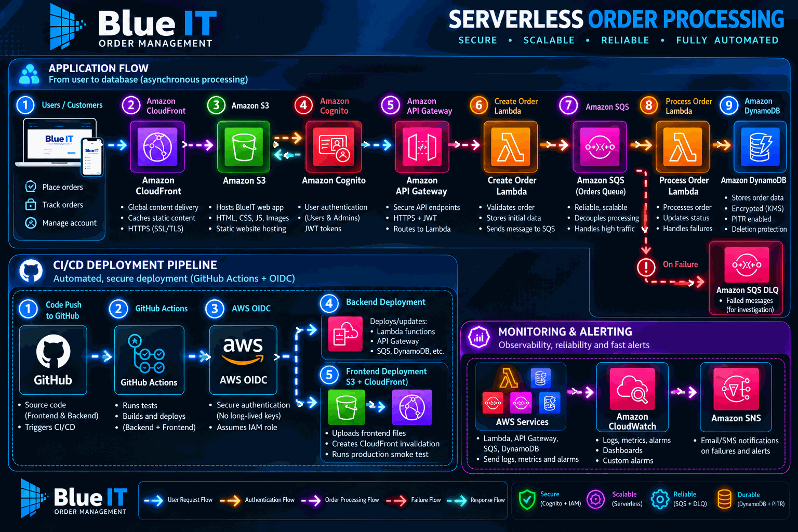

# BlueIT Serverless Order Processing System

A production-style **serverless order management platform built on AWS**.

BlueIT demonstrates an end-to-end cloud engineering solution covering secure authentication, REST APIs, event-driven processing, asynchronous messaging, NoSQL persistence, role-based administration, monitoring, failure recovery, Infrastructure as Code, automated testing, CI/CD, and production web delivery.

**Live Application:** https://store.bluetechnology.co.za

---

## Architecture



### Production Data Flow

```text
User
  |
  v
Amazon CloudFront
  |
  v
Private Amazon S3 Web Application
  |
  v
Amazon Cognito
  |
  | JWT
  v
Amazon API Gateway
  |
  +------------------------------+
  |                              |
  v                              v
Order Lambdas                 Admin Lambda
  |                              |
  v                              |
Amazon SQS                       |
  |                              |
  v                              |
Process Order Lambda             |
  |                              |
  +---------------+--------------+
                  |
                  v
           Amazon DynamoDB
```

Monitoring follows the path **API Gateway / Lambda / SQS / DLQ → CloudWatch → CloudWatch Alarms → SNS → email alerts**.

Production deployments follow **Git push → GitHub Actions → automated tests/SAM validation → GitHub OIDC → AWS SAM/CloudFormation → AWS production**.

---

## The Problem This Project Solves

A tightly coupled order application can make order intake dependent on downstream processing. If processing slows down or temporarily fails, requests can fail or clients may retry and create duplicate work.

BlueIT addresses this using an **event-driven serverless architecture**. Amazon SQS decouples order intake from processing, allowing the API to accept work without waiting for downstream processing to finish.

The solution provides asynchronous processing, traffic buffering, automatic retries, failed-message isolation, durable persistence, authenticated access, administrator role separation, controlled order lifecycle management, soft deletion and recovery, monitoring, and automated deployment.

---

## AWS Services

| Service | Responsibility |
|---|---|
| Amazon Cognito | Authentication and user identity |
| Amazon API Gateway | Authenticated REST API |
| AWS Lambda | Serverless application and administration logic |
| Amazon SQS | Asynchronous order queue |
| Amazon SQS DLQ | Failed-message isolation |
| Amazon DynamoDB | Persistent order storage |
| AWS KMS | DynamoDB encryption |
| Amazon CloudWatch | Logs, metrics, alarms and dashboard |
| Amazon SNS | Operational email alerts |
| AWS IAM | Application and deployment permissions |
| AWS SAM | Serverless Infrastructure as Code |
| AWS CloudFormation | Infrastructure provisioning |
| Amazon S3 | Private production web origin |
| Amazon CloudFront | HTTPS content delivery |
| AWS WAF | Web/API security controls |
| GitHub Actions | CI/CD automation |
| GitHub OIDC | Keyless AWS deployment authentication |

---

## Application Components

### Production Web Application

The production frontend is in `web_app/` and provides:

- Cognito login
- dashboard and order creation
- order listing, details, search, filtering and pagination
- automatic inactivity logout
- administrator console
- user administration
- pending, accepted and completed order views
- recycle bin and order restoration
- audit actor information

It is delivered through **CloudFront with a private S3 origin**.

### Desktop Application

`desktop_app/` contains the Python desktop client. The application has also been packaged as a Windows executable, demonstrating that the same AWS backend can support another client while retaining centralized authentication and API processing.

### Flutter Client

`frontend/order_app/` contains the earlier Flutter client with Cognito authentication, authenticated API access, order creation/retrieval, responsive UI, Windows support, Flutter Web support and idempotent order submission.

---

## Authentication and Role-Based Access

Users authenticate with **Amazon Cognito** and present a Cognito JWT to protected API Gateway routes.

BlueIT uses the Cognito group `Admins` for administrative authorization. Administrative functionality includes user listing/creation, enable/disable operations, granting/revoking administrator rights, self-protection against destructive admin actions, order lifecycle management, soft deletion, viewing deleted orders and restoring deleted orders.

---

## REST API

### Standard Order Endpoints

| Method | Endpoint | Purpose |
|---|---|---|
| `POST` | `/orders` | Create an order |
| `GET` | `/orders` | Retrieve orders |
| `GET` | `/orders/{order_id}` | Retrieve one order |
| `PATCH` | `/orders/{order_id}` | Update an order |

### Administrative Endpoints

| Method | Endpoint | Purpose |
|---|---|---|
| `GET` | `/admin/users` | List Cognito users |
| `POST` | `/admin/users` | Create/manage users |
| `PATCH` | `/admin/users/{username}` | Update a user |
| `DELETE` | `/admin/users/{username}` | Administrative user action |
| `PATCH` | `/admin/orders/{order_id}` | Manage order lifecycle |
| `DELETE` | `/admin/orders/{order_id}` | Soft-delete an order |
| `GET` | `/admin/orders/deleted` | Retrieve deleted orders |
| `PATCH` | `/admin/orders/{order_id}/restore` | Restore an order |

---

## Order Creation and Asynchronous Processing

An authenticated client submits `POST /orders` with customer and item information.

The Create Order Lambda validates the request, calculates the total, generates an `ORD-XXXXXXXX` identifier, sets the initial status to `QUEUED`, and publishes the order to SQS. Successful submissions return **HTTP 202 Accepted**.

The processing path is:

```text
API Gateway
     |
     v
Create Order Lambda
     |
     v
Amazon SQS
     |
     v
Process Order Lambda
     |
     v
Amazon DynamoDB
```

SQS provides loose coupling, buffering, retries, scalability and failure isolation.

### Idempotency

Order creation supports an `Idempotency-Key`, reducing the risk of duplicate order creation when clients retry a submission.

---

## Order Lifecycle

The controlled administrative lifecycle is:

```text
QUEUED -> ACCEPTED -> COMPLETED
```

Lifecycle changes record audit information such as `accepted_at`, `accepted_by`, `completed_at` and `completed_by`.

Backend processing persists the order; it does not represent business completion. An administrator explicitly advances the business lifecycle.

---

## Recycle Bin and Recovery

Administrative deletion uses **soft deletion** rather than immediately removing the DynamoDB item.

Deleted orders retain recovery metadata including:

```text
status = DELETED
deleted_at
deleted_by
previous_status
```

Normal order endpoints hide deleted records. Administrators can retrieve deleted orders and restore them to their previous lifecycle state. Restoration records `restored_at` and `restored_by`.

---

## DynamoDB Protection

Orders are stored in `ServerlessOrders` using `order_id` as the primary key.

Production protections include:

- PAY_PER_REQUEST billing
- server-side encryption with AWS KMS
- Point-in-Time Recovery
- deletion protection
- CloudFormation `DeletionPolicy: Retain`
- CloudFormation `UpdateReplacePolicy: Retain`

These controls reduce the risk of accidental production data loss during infrastructure changes.

---

## Failure Handling

The primary order queue uses an SQS redrive policy. Repeated processing failures are isolated in `serverless-order-dlq`, preventing poison messages from continuously disrupting normal processing.

---

## Monitoring and Alerting

The project includes the `serverless-order-processing-dashboard` CloudWatch dashboard and **10 production BlueIT alarms** covering:

1. API Gateway 4XX errors
2. API Gateway 5XX errors
3. API Gateway high latency
4. Create Order Lambda errors
5. Get Order Lambda errors
6. Get Orders Lambda errors
7. Process Order Lambda errors
8. Update Order Lambda errors
9. SQS queue backlog
10. DLQ messages

Alarm notifications flow through `serverless-order-alerts` in Amazon SNS to a confirmed email subscription.

---

## Security

Implemented controls include Cognito authentication, JWT-protected routes, Cognito-group RBAC, API request validation, throttling, CORS controls, AWS WAF, IAM permissions, DynamoDB encryption, KMS, PITR, DynamoDB deletion protection, a private S3 production origin, HTTPS through CloudFront, API/CloudWatch logging, and GitHub OIDC deployment without long-lived AWS access keys in GitHub.

---

## Infrastructure as Code

The backend infrastructure is defined in `template.yaml` using **AWS SAM** and deployed through **AWS CloudFormation**.

The production backend contains six Lambda functions:

```text
serverless-create-order
serverless-process-order
serverless-get-orders
serverless-get-order
serverless-update-order
serverless-admin
```

Application source is organized under `backend/`.

---

## Automated Testing

The backend currently has **32 passing pytest tests** covering order creation, validation, invalid JSON, idempotency, DynamoDB operations, order retrieval, pagination/sorting, missing orders, SQS event processing, malformed queue messages, multiple SQS records, update behavior and error handling.

Run locally with:

```powershell
python -m pytest -v
```

---

## CI/CD

### Backend CI

`.github/workflows/ci.yml` runs automated backend verification including Python tests, SAM validation and SAM build.

### Production Backend Deployment

`.github/workflows/deploy.yml` deploys after a successful qualifying CI run from `main`.

The deployment uses **GitHub OIDC** rather than long-lived AWS credentials:

```text
Push to main
     |
     v
Backend CI
     |
     v
GitHub OIDC
     |
     v
AWS Deployment Role
     |
     v
AWS SAM / CloudFormation
     |
     v
Production
```

A dedicated CloudFormation execution role performs infrastructure deployment.

### Frontend Deployment

`.github/workflows/frontend-deploy.yml` handles production `web_app` changes. It authenticates through OIDC, uploads the explicit production frontend files to S3, creates a CloudFront invalidation and performs a production smoke test.

The deployment intentionally avoids a destructive repository-wide `s3 sync --delete`.

### Production Smoke Test

After frontend deployment, the workflow checks `https://store.bluetechnology.co.za` and requires **HTTP 200** with a non-empty response body.

### Flutter CI

`.github/workflows/flutter-ci.yml` provides CI coverage for the Flutter client.

---

## Repository Structure

```text
serverless-order-processing/
|
|-- .github/
|   `-- workflows/
|       |-- ci.yml
|       |-- deploy.yml
|       |-- flutter-ci.yml
|       `-- frontend-deploy.yml
|
|-- backend/
|   |-- admin/
|   |-- create_order/
|   |-- get_order/
|   |-- get_orders/
|   |-- process_order/
|   `-- update_order/
|
|-- desktop_app/
|
|-- docs/
|   |-- assets/
|   |   `-- blueit-architecture.gif
|   |-- architecture.md
|   `-- architecture.png
|
|-- frontend/
|   `-- order_app/
|
|-- tests/
|
|-- web_app/
|   |-- assets/
|   |-- css/
|   |-- js/
|   `-- index.html
|
|-- .gitignore
|-- README.md
|-- samconfig.toml
`-- template.yaml
```

Development backups and generated artifacts are intentionally omitted from this simplified architecture view.

---

## Engineering Challenges Solved

This project includes practical troubleshooting and production hardening, not only resource creation.

- **Cognito authorization:** diagnosed unauthorized API requests and verified the correct token/authorizer flow.
- **DynamoDB numeric serialization:** corrected Python numeric handling and `Decimal` JSON serialization.
- **Idempotency:** added protection against duplicate work caused by retries.
- **SQS recovery:** validated retry behavior and Dead-Letter Queue isolation.
- **CloudFormation recovery:** recovered the production stack from `UPDATE_ROLLBACK_FAILED`.
- **GitHub OIDC:** hardened the AWS trust relationship to the repository/main-branch deployment subject.
- **SAM deployment permissions:** corrected execution-role access for the SAM transform and deployment artifacts.
- **API Gateway logging:** verified the regional CloudWatch logging role and permissions.
- **Production data protection:** enabled encryption, PITR, deletion protection and CloudFormation retention.
- **Frontend deployment:** added explicit-file deployment, CloudFront invalidation and a live HTTP smoke test.

---

## Reliability Features

- serverless and event-driven architecture
- asynchronous SQS processing
- automatic Lambda scaling
- SQS retries and DLQ isolation
- DynamoDB PITR and deletion protection
- idempotent order submission
- controlled lifecycle transitions
- soft deletion and restoration
- CloudWatch dashboard and alarms
- SNS notifications
- automated tests and CI
- OIDC-based production deployment
- production smoke testing

---

## Skills Demonstrated

**AWS:** Cognito, API Gateway, Lambda, SQS, DynamoDB, KMS, CloudWatch, SNS, IAM, S3, CloudFront, WAF, SAM and CloudFormation.

**Development:** Python, boto3, REST APIs, JSON, JavaScript, HTML, CSS, Flutter/Dart, asynchronous processing, event-driven architecture, error handling and pytest.

**DevOps:** Git, GitHub Actions, CI/CD, GitHub OIDC, Infrastructure as Code, SAM, CloudFormation, automated deployments and production smoke testing.

**Security & Operations:** authentication, JWT authorization, RBAC, IAM, encryption, HTTPS, WAF, API validation, throttling, CloudWatch logs/metrics/alarms, SNS alerting, DLQ monitoring and production troubleshooting.

---

## Current Project Status

| Component | Status |
|---|---|
| Production web application | Complete |
| Cognito authentication and RBAC | Complete |
| REST API | Complete |
| Asynchronous SQS processing | Complete |
| DynamoDB persistence/protection | Complete |
| Order lifecycle | Complete |
| Administrator console and user administration | Complete |
| Soft delete / recycle bin / restoration | Complete |
| DLQ failure handling | Complete |
| Idempotency | Complete |
| CloudWatch dashboard and 10 alarms | Complete |
| SNS email alerting | Complete |
| 32 backend tests | Complete |
| Backend CI/CD | Complete |
| GitHub OIDC | Complete |
| Frontend CI/CD and smoke test | Complete |
| CloudFront production delivery | Complete |
| Desktop application | Complete |
| Flutter client and CI | Complete |
| Architecture documentation | Complete |

---

## Future Improvements

Potential future enhancements include:

- DynamoDB GSI/query-based order listing at larger scale
- API pagination tokens
- AWS X-Ray distributed tracing
- separate development, staging and production environments
- business-level CloudWatch metrics
- customer order notifications through Amazon SES
- expanded integration and end-to-end automated testing

---

## Author

**Musa Mabasa**
AWS Cloud Engineer & IT Professional

- BSc in IT Management
- AWS Certified Cloud Practitioner
- AWS Certified Solutions Architect – Associate
- CompTIA A+

This project forms part of my practical AWS Cloud Engineering portfolio.
