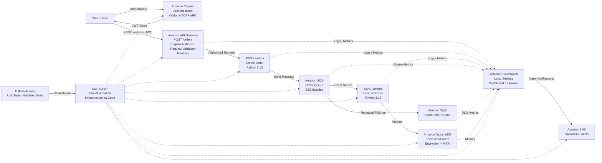

# Serverless Order Processing Architecture

## Request Flow

1. The client authenticates using Amazon Cognito.
2. Cognito returns a JWT token.
3. The client submits an authenticated `POST /orders` request to Amazon API Gateway.
4. API Gateway validates authentication, request structure, and throttling limits.
5. Create Order Lambda validates the order and publishes it to Amazon SQS.
6. Amazon SQS decouples order submission from asynchronous processing.
7. Process Order Lambda consumes the SQS message.
8. The processed order is stored in Amazon DynamoDB with status `COMPLETED`.
9. Failed messages are retried and eventually moved to the Dead-Letter Queue.
10. Amazon CloudWatch collects logs, metrics, alarms, and dashboard data.
11. CloudWatch alarms send notifications through Amazon SNS.

## CI Pipeline

GitHub Actions automatically runs on pushes and pull requests to `main`.

`Git Push -> Unit Tests -> SAM Validation -> SAM Build`