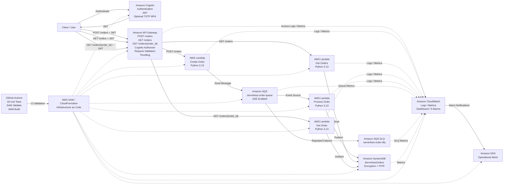

# Serverless Order Processing Architecture



## API Operations

The system supports three authenticated API operations:

```text
POST /orders
GET  /orders
GET  /orders/{order_id}
```

All routes are protected by the Amazon Cognito User Pool authorizer.

---

## Create Order Flow

1. The user authenticates through Amazon Cognito.
2. Cognito returns a JWT.
3. The client sends `POST /orders`.
4. API Gateway validates authentication and the request body.
5. Create Order Lambda validates the order.
6. Create Order Lambda sends the order to Amazon SQS.
7. SQS asynchronously invokes Process Order Lambda.
8. Process Order Lambda sets the order status to `COMPLETED`.
9. The completed order is stored in DynamoDB.

### IAM

Create Order Lambda:

```text
sqs:SendMessage
```

Process Order Lambda:

```text
dynamodb:PutItem
```

---

## Retrieve All Orders Flow

1. The client sends an authenticated `GET /orders` request.
2. API Gateway validates the JWT.
3. Get Orders Lambda scans the DynamoDB table.
4. The Lambda follows `LastEvaluatedKey` when additional pages are available.
5. Orders are combined and sorted newest-first.
6. DynamoDB `Decimal` values are converted to JSON-compatible values.
7. The API returns the count and order collection.

### IAM

Get Orders Lambda:

```text
dynamodb:Scan
```

---

## Retrieve One Order Flow

1. The client sends an authenticated request:

```text
GET /orders/{order_id}
```

2. API Gateway validates the JWT.
3. API Gateway passes `order_id` as a path parameter.
4. Get Order Lambda calls DynamoDB `GetItem`.
5. If the order exists, the Lambda returns HTTP 200.
6. If the order does not exist, the Lambda returns HTTP 404.
7. Missing path parameters return HTTP 400.
8. DynamoDB failures return HTTP 500.

### IAM

Get Order Lambda:

```text
dynamodb:GetItem
```

Using `GetItem` avoids scanning the entire table when the primary key is already known.

---

## Authentication

Amazon Cognito protects all application routes.

```text
Client
  |
  v
Amazon Cognito
  |
  v
JWT
  |
  v
API Gateway
```

Unauthenticated requests return:

```text
Unauthorized
```

Security configuration includes:

* Optional TOTP MFA
* Strong password requirements
* Verified email changes
* Access token lifetime of 1 hour
* ID token lifetime of 1 hour
* Refresh token lifetime of 7 days
* User-existence error protection

---

## Failure Handling

The SQS processing path uses a Dead-Letter Queue.

```text
Main SQS Queue
      |
      v
Process Order Lambda
      |
   Failure
      |
      v
SQS Retry
      |
Repeated Failure
      |
      v
Dead-Letter Queue
```

Redrive policy:

```text
maxReceiveCount = 3
```

Failed-message handling has been tested successfully.

---

## Data Storage

Orders are stored in:

```text
ServerlessOrders
```

Primary key:

```text
order_id
```

The table uses:

* PAY_PER_REQUEST billing
* Server-side encryption
* Point-in-Time Recovery

---

## Monitoring and Alerting

Amazon CloudWatch provides centralized observability.

The project now contains **9 CloudWatch alarms**:

1. Create Order Lambda errors
2. Process Order Lambda errors
3. Get Orders Lambda errors
4. Get Order Lambda errors
5. DLQ messages detected
6. Main queue backlog
7. API Gateway 5XX errors
8. API Gateway 4XX errors
9. API Gateway high latency

The Get Order alarm is:

```text
serverless-get-order-errors
```

and has been verified in `OK` state.

CloudWatch also provides:

* Lambda logs
* API Gateway access logs
* SQS metrics
* DynamoDB metrics
* API metrics
* CloudWatch dashboard

Alarms publish operational notifications through Amazon SNS.

---

## CloudWatch Logs

Relevant log groups include:

```text
/aws/lambda/serverless-create-order
/aws/lambda/serverless-process-order
/aws/lambda/serverless-get-orders
/aws/lambda/serverless-get-order
/aws/apigateway/serverless-order-api
```

---

## Infrastructure as Code

The infrastructure is defined in:

```text
template.yaml
```

using AWS SAM and deployed through CloudFormation.

Managed infrastructure includes:

* Cognito User Pool
* Cognito App Client
* API Gateway
* Cognito Authorizer
* 4 Lambda functions
* Lambda IAM roles
* Lambda permissions
* SQS queue
* SQS DLQ
* SQS event source mapping
* DynamoDB table
* 9 CloudWatch alarms
* CloudWatch dashboard
* API access log group
* SNS topic
* SNS email subscription

---

## Automated Testing

The current test suite contains:

```text
18 tests
```

Test files:

```text
tests/test_create_order.py
tests/test_get_orders.py
tests/test_get_order.py
tests/test_process_order.py
```

Coverage includes:

* Valid order creation
* Invalid request handling
* SQS publishing
* DynamoDB writes
* List retrieval
* Empty-order retrieval
* Sorting
* DynamoDB pagination
* Single-order retrieval
* HTTP 404 behavior
* Missing path parameters
* DynamoDB errors
* Multiple SQS records

Current result:

```text
18 passed
```

---

## CI Pipeline

GitHub Actions runs automatically on pushes and pull requests to `main`.

```text
Git Push
   |
   v
GitHub Actions
   |
   v
Python 3.13
   |
   v
18 Unit Tests
   |
   v
SAM Validation
   |
   v
SAM Build
```

The current single-order feature passed CI successfully.

---

## Reliability Features

The architecture demonstrates:

* Event-driven design
* Asynchronous SQS processing
* Lambda automatic scaling
* SQS retries
* Dead-Letter Queue isolation
* DynamoDB Point-in-Time Recovery
* DynamoDB pagination handling
* Efficient `GetItem` retrieval
* CloudWatch monitoring
* 9 CloudWatch alarms
* SNS notifications
* Automated tests
* CI validation
* Infrastructure as Code

---

## Security Features

The architecture includes:

* Amazon Cognito authentication
* JWT authorization
* Optional TOTP MFA
* IAM least privilege
* API throttling
* Request validation
* SQS encryption
* DynamoDB encryption
* API access logging
* Secure token handling
* No production credentials stored in Git
