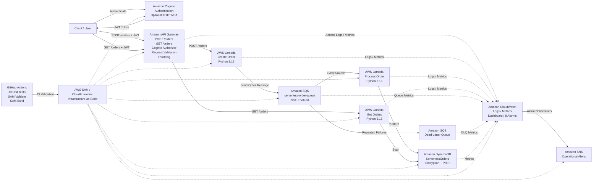

# Serverless Order Processing Architecture

## Create Order Flow

1. The client authenticates using Amazon Cognito.
2. Cognito returns a JWT token.
3. The client submits an authenticated `POST /orders` request.
4. API Gateway validates the JWT and request body.
5. Create Order Lambda validates and queues the order.
6. Amazon SQS asynchronously invokes Process Order Lambda.
7. Process Order Lambda sets the order status to `COMPLETED`.
8. The completed order is stored in DynamoDB.

## Retrieve Orders Flow

1. The client authenticates using Amazon Cognito.
2. The client sends an authenticated `GET /orders` request.
3. API Gateway validates the JWT.
4. Get Orders Lambda scans the DynamoDB table.
5. DynamoDB pagination is handled automatically.
6. Orders are sorted newest-first.
7. The Lambda returns the order count and order collection.

## Failure Handling

The primary SQS queue uses a redrive policy with:

`maxReceiveCount = 3`

Repeatedly failing messages are moved to:

`serverless-order-dlq`

The retry and DLQ path has been tested successfully.

## Security

The architecture includes:

- Cognito JWT authentication
- Optional TOTP MFA
- Password-policy enforcement
- Verified email updates
- API Gateway throttling
- API request validation
- IAM least privilege
- SQS server-side encryption
- DynamoDB encryption
- DynamoDB Point-in-Time Recovery

## Monitoring

Amazon CloudWatch provides:

- API Gateway access logs
- Lambda logs
- API metrics
- Lambda metrics
- SQS metrics
- DynamoDB metrics
- Operational dashboard
- 8 CloudWatch alarms

CloudWatch alarms publish notifications through Amazon SNS.

## CI Pipeline

GitHub Actions automatically runs on pushes and pull requests to `main`.

`Git Push -> 13 Unit Tests -> SAM Validation -> SAM Build`